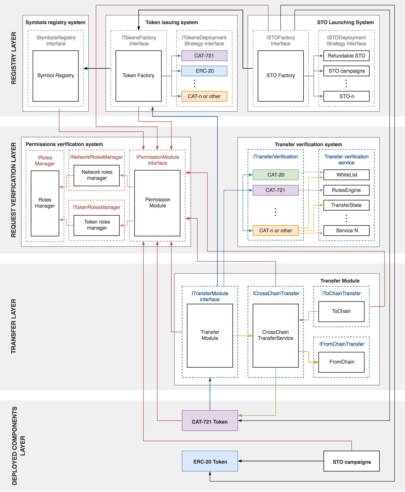

## Tokens Issuing Platform
Platform supports the most popular tokens standards and its modifications on Ethereum blockchain. Modified tokens standards provide the symbol uniqueness in the network, additional security and protection for tokens owners by means of symbol registry, permission and transfer modules.

## Project architecture and relations beetwen components


                      Picture 1 - Project architecture and relations beetwen components

**1. Registry layer** goals are: Register new token Symbols, Store a list of all created tokens Create new tokens and companies STO.

Components:
* **Symbol registry system** is a repository for symbol instances. It also provides an opportunity to register token symbols in our network. 
* **Token Issuing system** deploys new token.
  - **Token Factory** is a component which accepts a request to create a new token, Request consist of: 
    _TokenName_, _TokenSymbol_, _TokenSupply_, _TokenStandard_.
    Token Factory Checks parameters, checks whether chosen standard is supported in our system.Then Tokens Factory sends request to the "Token Deployment Strategy".
  - **Token Deployment Strategy** to check a standard and add strategy according to the chosen standard (only 1 strategy available for 1 standard) and deploys the token.

**2. Request verification layer** provide reliable security at any request which goes to the Smart Contracts.

Components:
* **Permissions verification system** serves as a core for verification of the requests which are processed in our Smart Contracts. It includes:
  - **Permission Module** is a flexible mechanism which allows to create and set rules for accessing the network components.     Permission Module grants the ability to take control over the token issuance, symbol registration, registration of new       verification services, adding/removal strategies, etc.
  - **Network Roles Manager**  - verifies request which belongs to our system (Register a symbol, Token Creation, Adding new     Strategies, Adding new transfer verification services).
  - **Token Roles Manager** - verifies requests which belong to the token. (Example add/remove to/from the WhiteList, create     RollBack).
* **Transfer verification system** validates transactions through Transfer module by the logic which was related to the token standard. Each standard can implement own transfer verification logic and can contain one or few verification services. (WhiteList, Rules Engine).
  - **Transfer Verification** contains “transfer verification logic” created for each standard.  “Transfer verification           logic” can be implemented by means of different “transfer verification services”. There could be different “transfer         verification services” for each standard.
  - **Transfer Verification Service**
      - **Whitelist** stores the list of accounts with a proven identity over KYC. Hence  WhiteList checks the accounts which         send or receive requests in our Smart contracts. If an account is not found in the WhiteList request would be                 rejected. (Applied for Securrency standards CAT-20, CAT-721)

**3.Transaction layer** - stands for token transfers from one account to the other via the verification layer. Transfer layer extends the token transfer on: whiteList verification and Cross-Chain transfers.

Components:
* **Transfer Module** receives requests and sends them to the token factory to get to know the information about the token. Tokens factory accepts the token address and approves that this token exists to provide its standard. Later when the information is received from Token factory transfer module sends it on verification to the "transfer verification layer" where the token is getting verified according to the whitelists, rules engine etc services which have been provided in the standard.
* **Cross Chain service** allow transfer tokens to the other chain. Before it checks who's transaction initiator, whether it's "Transfer module" or not.  If the request comes from "Transfer module", **"FromChain"** records the transaction to the blockchain: token address, token owner, target chain, targetAddress Recipient wallet in the other chain, value Amount of tokens or token id for the CAT-721 token. **"ToChain"** gets the direct requests from the verified third party (Securrency)  and sends third-party's wallet to the Permission module to check whether this wallet is allowed to perform cross chain transaction or not. "FromChain" module records the following information into the blockchain: 
  - _fromTokenAddress_ Token address in the previous chain 
  - _sentFrom_ Sender address in the previous chain
  - _recipient_  address 
  - _tokenAddress_ Token address in the current chain 
  - _from_ Original chain
  - _originalTxHash_ Tx hash which initiate cross chain transfer 
  - _value_ Amount of tokens || token id for the CAT-721 token

## Package version requirements for your machine:

- node v8.10.0
- npm v3.5.2
- Truffle v4.1.13 (core: 4.1.13)
- Solidity v0.4.24 (solc-js)
- Ganache CLI v6.1.6 (ganache-core: 2.1.5)

## Setup

The smart contracts are written in [Solidity](https://github.com/ethereum/solidity) and tested/deployed using [Truffle](https://github.com/trufflesuite/truffle) version 4.1.13.

[Description](docs/project-setup/setup.md)

## Testing

To test the code simply run:

```bash
$ truffle test
```

## Deploying

To deploy the code simply run:

```bash
$ truffle migrate
```
## CLI applications
[docs](docs/cli-applications/description.md)